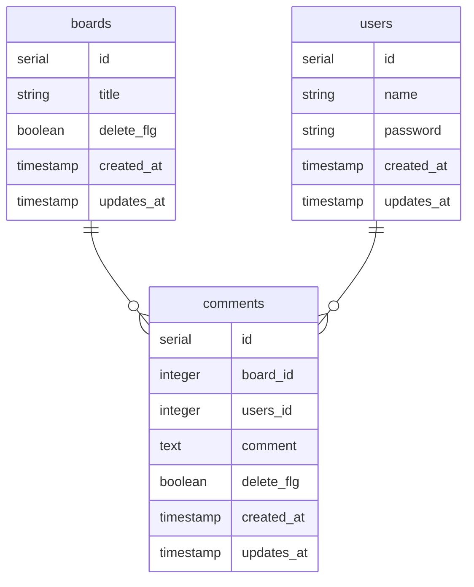

環境構築は前回の記事を参照してください。
[ローカル環境でAWS SAM Lambda + Java + PostgreSQLを使って掲示板APIを作る１ ~環境構築編~](https://zenn.dev/ks1905/articles/aws-lambda-java-1)

## ローカルDB準備
### 1. プロジェクトディレクトリ作成
まず今回作成する掲示板APIのディレクトリを作成します。
```sh:powershell
mkdir keijiban-app
cd keijiban-app
```

<br />

### 2. docker-compose.yaml作成
今回使用するPostgreSQLとnetworkを記載します。<br />
networkを作成する理由としては、sam-cliを使用してAWS Lambdaをローカルで起動する場合はsam用のdockerコンテナを利用して起動されます。
AWS LambdaでDBを使用する場合、dockerコンテナが異なりネットワークが異なるため、ネットワーク通信の設定が必要となります。
それを省くため、networkを作成し同一ネットワーク内で起動させます。
:::details ./docker-compose.yaml
```yaml:docker-compose.yaml
version: '3.5'

networks:
    container-link:
        name: docker.internal

services:
    db:
        image: postgres:14
        container_name: db
        environment:
            POSTGRES_USER: root
            POSTGRES_PASSWORD: root
            POSTGRES_DB: keijiban_local
            TZ: Asia/Tokyo
        volumes:
            - ./docker/init.d/:/docker-entrypoint-initdb.d/
        network:
            - container-link
        ports:
            - "5432:5432"

volumes:
    keijiban-local-volume:
```
:::
<br />

### 3. 初期データのSQLを作成
postgreSQLのDockerコンテナ作成と同時に初期データを入れたいのでinit.sqlを作成します。
:::details ./dicker/init.d/init.sql
```sql:init.sql
-- 掲示板テーブル
create table if not exists boards(
    id serial primary key,
    title varchar(20) not null,
    delete_flg boolean default false,
    created_at TIMESTAMPTZ NOT NULL DEFAULT CURRENT_TIMESTAMP, 
    updated_at TIMESTAMPTZ NOT NULL DEFAULT CURRENT_TIMESTAMP 
);
-- ユーザーテーブル
create table if not exists users(
    id serial primary key,
    name varchar(10) not null,
    password varchar(20) not null,
    created_at TIMESTAMPTZ NOT NULL DEFAULT CURRENT_TIMESTAMP,
    updated_at TIMESTAMPTZ NOT NULL DEFAULT CURRENT_TIMESTAMP 
);
-- コメントテーブル
create table if not exists comments(
    id serial primary key,
    board_id int not null,
    user_id int not null,
    comment text not null,
    delete_flg boolean default false,
    created_at TIMESTAMPTZ NOT NULL DEFAULT CURRENT_TIMESTAMP,
    updated_at TIMESTAMPTZ NOT NULL DEFAULT CURRENT_TIMESTAMP 
);
-- テストデータ挿入
insert into boards(title) values ('test掲示板');
insert into users(name, password) values ('user01', 'pass1234');
insert into users(name, password) values ('user02', 'pass1234');
insert into comments(board_id, user_id, comment) values (1, 1, 'user001 comment1');
insert into comments(board_id, user_id, comment) values (1, 2, 'user001 comment1');
insert into comments(board_id, user_id, comment) values (1, 1, 'user001 comment2');
```
:::
今回作成する掲示板APIのDBは以下の通りです。

<br />
最終的なフォルダ構成は以下のようになります。
```
keijiban-app
├ docker
│  └ init.d
│     └ init.sql
└ docker-compose.yaml
```
<br />

### 4. 起動
Dockerを起動してDBが作成されるか確認します。
```sh:powershell
docker-compose up -d
docker-compose ps
```
正常にコンテナが作成された場合、以下のような出力がされます。

<br />
次にDBにアクセスして確認します。
```sh:powershell
docker exec -it db psql -U root keijiban_local
```

テーブルの確認と実際にデータが投入されているか確認
```sh:powershell
\d
```

```sh:powershell
select * from boards;
select * from users;
select * from comments;
```

<br />

## おわり
Dockerを使ってのローカルDB作成は以上となります。
次回から実際にsam-cliを使ってAWS Lambdaを作っていきます！
<br>
次の記事はこちら
[ローカル環境でAWS SAM Lambda + Java + PostgreSQLを使って掲示板APIを作る２ ~DB準備編~](https://zenn.dev/ks1905/articles/aws-lambda-java-2)
