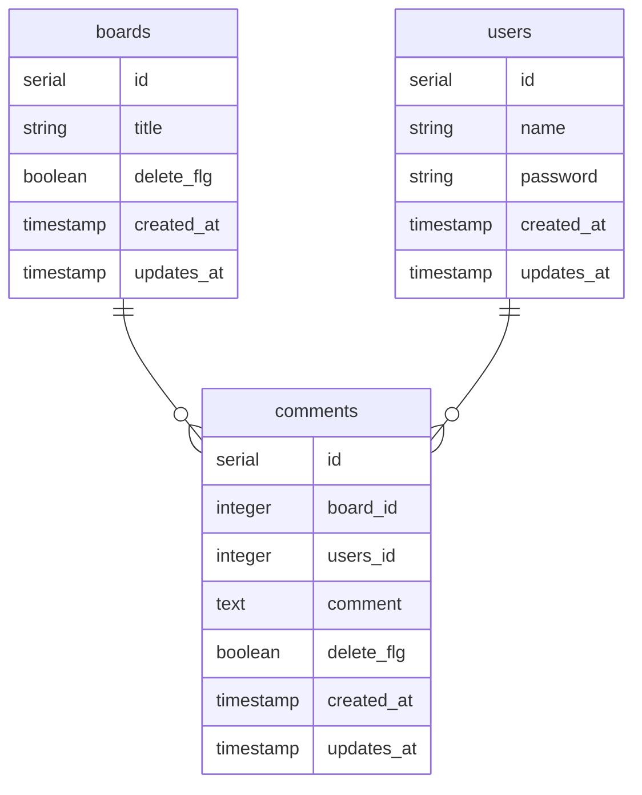

環境構築は前回の記事を参照してください。
[ローカル環境でAWS SAM Lambda + Java + PostgreSQLを使って掲示板APIを作る１ ~環境構築編~](https://zenn.dev/ks1905/articles/aws-lambda-java-1)

## ローカルDB準備
* プロジェクトディレクトリ作成
まず今回作成する掲示板APIのディレクトリを作成します。
```sh:powershell
mkdir keijiban-app
cd keijiban-app
```


* docker-compose.yaml作成
今回使用するPostgreSQLとnetworkを記載します。<br />
networkを作成する理由としては、sam-cliを使用してAWS Lambdaをローカルで起動する場合はsam用のdockerコンテナを利用して起動されます。
AWS LambdaでDBを使用する場合、dockerコンテナが異なりネットワークが異なるため、ネットワーク通信の設定が必要となります。
それを省くため、networkを作成しで同一ネットワーク内で起動させます。
```yaml:docker-compose.yaml
version: '3.5'

networks:
    container-link:
        name: docker.internal

services:
    db:
        image: postgres:14
        container_name: db
        environment:
            POSTGRES_USER: root
            POSTGRES_PASSWORD: root
            POSTGRES_DB: keijiban_local
            TZ: Asia/Tokyo
        volumes:
            - ./docker/init.d/:/docker-entrypoint-initdb.d/
        network:
            - container-link
        ports:
            - "5432:5432"

volumes:
    keijiban-local-volume:
```
* 初期データのSQLを作成
postgreSQLのDockerコンテナ作成と同時に初期データを入れたいのでinit.sqlを作成します。
```sql:init.sql
create table if not exists boards(
    id serial primary key,
    title varchar(20) not null,
    delete_flg boolean default false,
    created_at TIMESTAMPTZ NOT NULL DEFAULT CURRENT_TIMESTAMP, 
    updated_at TIMESTAMPTZ NOT NULL DEFAULT CURRENT_TIMESTAMP 
);
create table if not exists users(
    id serial primary key,
    name varchar(10) not null,
    password varchar(20) not null,
    created_at TIMESTAMPTZ NOT NULL DEFAULT CURRENT_TIMESTAMP,
    updated_at TIMESTAMPTZ NOT NULL DEFAULT CURRENT_TIMESTAMP 
);
create table if not exists comments(
    id serial primary key,
    board_id int not null,
    user_id int not null,
    comment text not null,
    delete_flg boolean default false,
    created_at TIMESTAMPTZ NOT NULL DEFAULT CURRENT_TIMESTAMP,
    updated_at TIMESTAMPTZ NOT NULL DEFAULT CURRENT_TIMESTAMP 
);
insert into boards(title) values ('test掲示板');
insert into users(name, password) values ('user01', 'pass1234');
insert into users(name, password) values ('user02', 'pass1234');
insert into comments(board_id, user_id, comment) values (1, 1, 'user001 comment1');
insert into comments(board_id, user_id, comment) values (1, 2, 'user001 comment1');
insert into comments(board_id, user_id, comment) values (1, 1, 'user001 comment2');
```
今回作成する掲示板APIのDBは以下の通りです。


```
keijiban-app
├ docker
│  └ init.d
│     └ init.sql
└ docker-compose.yaml
```